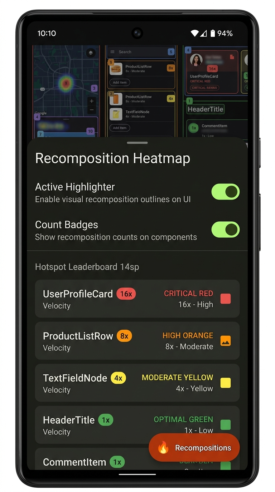
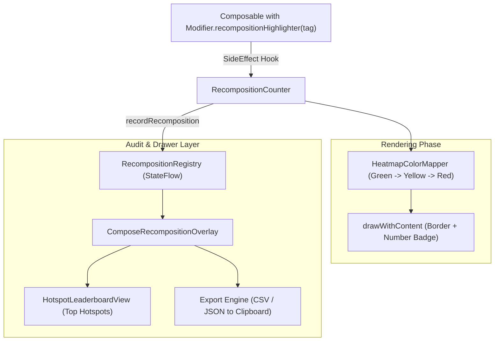

# 🔥 compose-recomposition-highlighter

[](LICENSE)
[](https://kotlinlang.org)
[](https://developer.android.com)

> **On-Device Visual Recomposition Heatmap Overlay & Real-Time Performance Audit Drawer for Jetpack Compose.**

`compose-recomposition-highlighter` is a zero-overhead developer tool that enables Android developers and QA engineers to **visually detect wasteful recompositions, unstable parameters, and infinite render loops directly on physical devices** without tethering to Android Studio Layout Inspector.

<p align="center">
  
</p>

---

## ✨ Features

- 🟢🟡🟠🔴 **Visual Recomposition Heatmap**: Outlines composables with dynamic colored borders based on render frequency:
  - 🟢 **1–2x (Green)**: Optimal isolated state
  - 🟡 **3–5x (Yellow)**: Moderate rendering
  - 🟠 **6–9x (Orange)**: High recomposition rate
  - 🔴 **10x+ (Crimson Red)**: Critical jank / infinite recomposition loop alert!
- 🔢 **Top-Right Count Badges**: Displays exact recomposition count badge directly over each composable with zero layout shifts.
- 🏆 **Hotspot Leaderboard**: Ranked drawer listing top most frequently recomposing composables with live velocity rates (`recomps/sec`).
- 📋 **1-Tap Export**: Export recomposition audit reports directly as CSV or formatted JSON to the clipboard.
- 📱 **Floating Compose HUD**: Draggable bottom HUD badge showing total screen recomposition cycles.

---

## 🏛️ Architecture & How It Works



---

## 📦 Installation

Add JitPack to your `settings.gradle.kts`:

```kotlin
repositories {
    maven { url = uri("https://jitpack.io") }
}
```

Add the dependency to your app's `build.gradle.kts`:

```kotlin
dependencies {
    debugImplementation("com.github.zakayothuku:compose-recomposition-highlighter:v1.0.0")
}
```

---

## 🚀 Quickstart

### 1. Attach Modifier to Any Composable

Add `Modifier.recompositionHighlighter("Tag")` to any composable you wish to track:

```kotlin
@Composable
fun UserProfileCard(user: User) {
    Card(
        modifier = Modifier
            .fillMaxWidth()
            .recompositionHighlighter("UserProfileCard") // 👈 Attach highlighter
    ) {
        Text(text = user.name)
    }
}
```

### 2. Attach Floating Compose UI Overlay

Place `ComposeRecompositionOverlay()` inside your top-level `Surface` or `Scaffold`:

```kotlin
@Composable
fun AppContent() {
    Box(modifier = Modifier.fillMaxSize()) {
        YourMainNavigation()

        // Attach floating Recomposition HUD & Bottom Sheet
        ComposeRecompositionOverlay()
    }
}
```

---

## 🛠️ Advanced Programmatic Control

```kotlin
// Toggle highlighting globally at runtime
RecompositionRegistry.setGlobalEnabled(false)

// Toggle numerical count badges
RecompositionRegistry.setShowCountBadges(false)

// Reset all tracked node counters
RecompositionRegistry.resetAll()

// Programmatically export audit reports
val csvReport = RecompositionRegistry.exportReportAsCsv()
val jsonReport = RecompositionRegistry.exportReportAsJson()
```

---

## 🧪 Testing

Run library unit tests:

```bash
./gradlew :library:test
```

Build sample application:

```bash
./gradlew :app:assembleDebug
```

---

## 📄 License & Author

Developed & maintained by **Zakayo Thuku** ([@zakayothuku](https://github.com/zakayothuku)).

```
MIT License - Copyright (c) 2026 Zakayo Thuku
```
